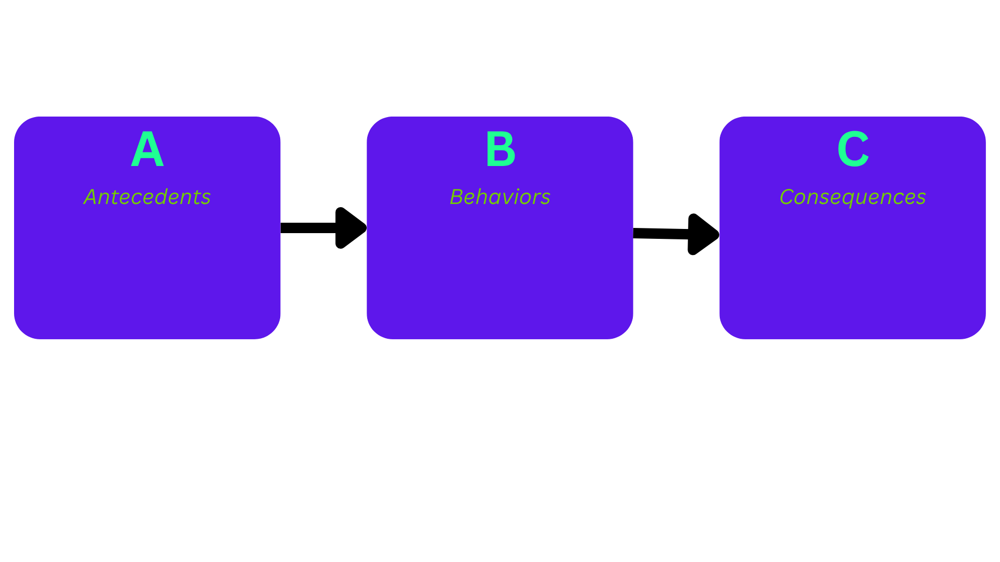

# AI for Applied Behavioral Analysis (ABA)

## Applied Behavioral Analysis (ABA) Fundamentals
Therapy based on the science of learning and behavior.

Positive reinforcement is one of the top strategies used in ABA.

#### Antecedent, Behavior, Consequence (A-B-Cs)

_Antecedent_: what happens BEFORE a behavior occurs

_Behavior_: person's response or lack of response to the antecedent.

_Consequence_: what happens AFTER a behavior occurs

## Objective
Many people with autism and other neurodivergent traits have difficulty understanding subtle emotional or social cues, which results in anxiety, miscommunication, and stress.
There are many AI chatbots and emotional assistants out there, but only very few incorporate ABA — mostly to diagnose people who might be on the autism spectrum.

The goal is to develop emotionally aware AI tools grounded in *Applied Behavioral Analysis (ABA)* that helps individuals who are neurodivergence to better understand, manage, and respond to social & emotional triggers with clarity and compassion. This would be accomplished by identifying emotional triggers and providing supportive feedback using the ABA model.

## Users
- Individuals with Autism who are self-aware and want to improve
- ABA educators and therapist looking into digital assistive tools
- Parents and caregivers who want to help the child on the spectrum with emotional self-regulation

## Features
- Trigger-response dataset
- Retrieval logic

# System Architecture
TBA

## Security & Compliance
TBA

## Roadmap
TBA

## DISCLAIMER

This tool is an experimental AI project inspired by Applied Behavior Analysis (ABA). It's designed for educational and self-reflective use ONLY. 
It is NOT a substitute for professional therapy, diagnosis, or clinical advice. 

## References & Acknowledgements

Autism Speaks. “Applied Behavior Analysis (ABA).” Autism Speaks, 2021, www.autismspeaks.org/applied-behavior-analysis.

