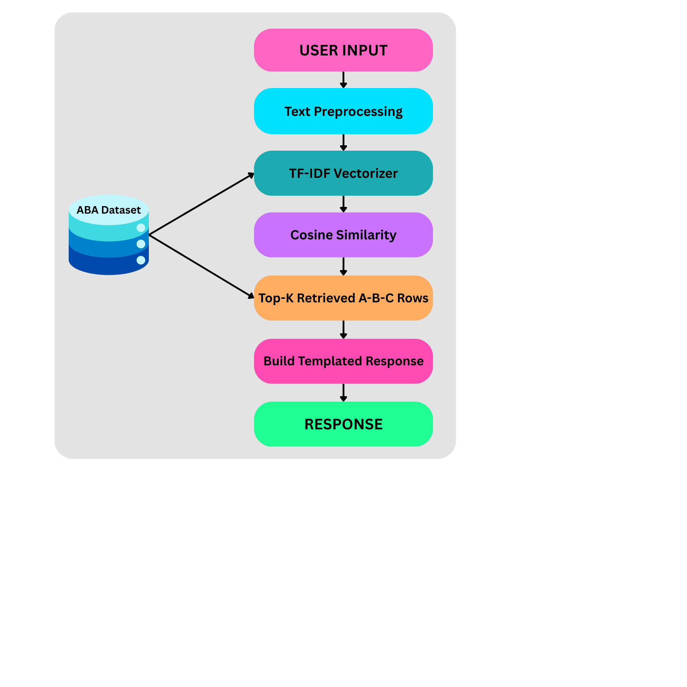
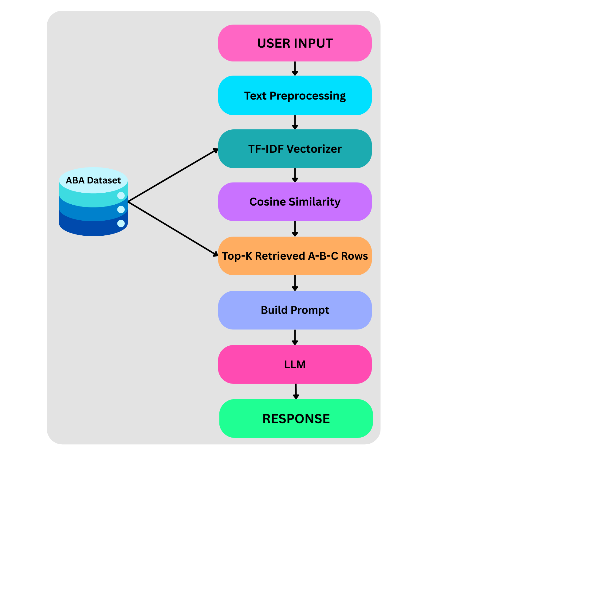
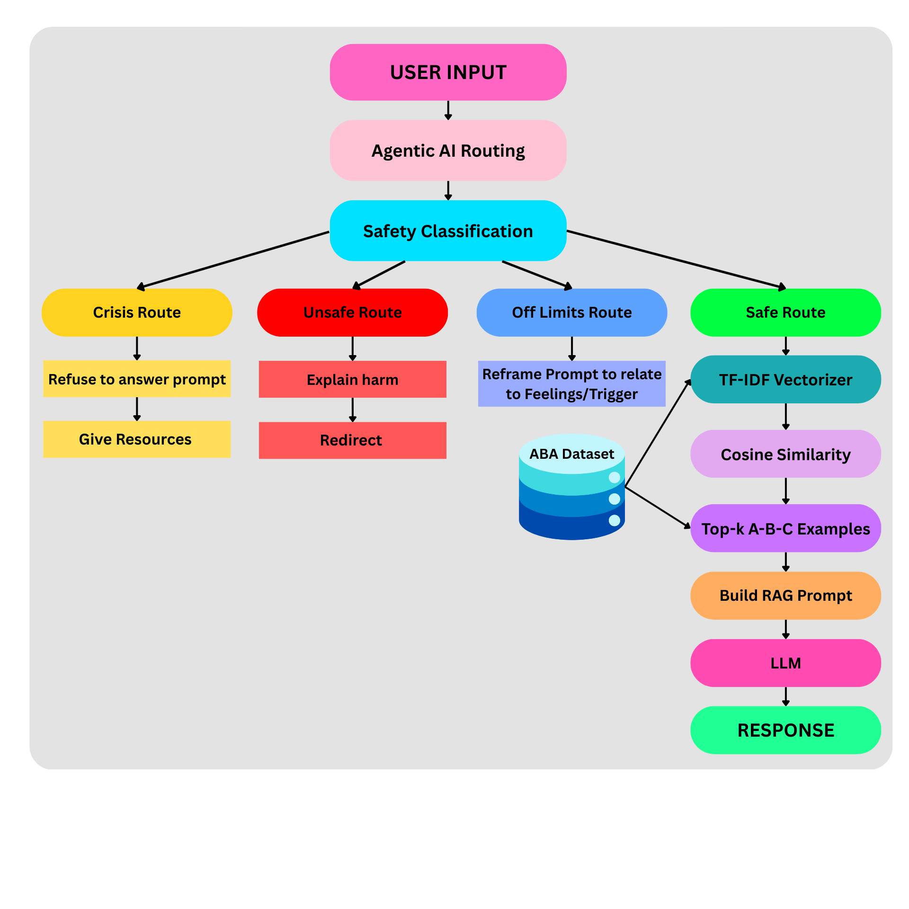

# AI for Applied Behavioral Analysis (ABA)

## DISCLAIMER

This tool is an experimental AI project inspired by Applied Behavior Analysis (ABA). It's designed for educational and self-reflective use ONLY. 

If you or someone else is in IMMEDIATE danger, please contact EMERGENCY SERVICES!

It is NOT a substitute for professional therapy, diagnosis, or clinical advice. 

## Applied Behavioral Analysis (ABA) Fundamentals
Therapy based on the science of learning and behavior.

Positive reinforcement is one of the top strategies used in ABA.

#### Antecedent, Behavior, Consequence (A-B-Cs)

In ABA, there is an A-B-C framework:

_Antecedent_(**A**): what happens *BEFORE* a behavior occurs

_Behavior_(**B**): person's response or lack of response to the antecedent.

_Consequence_(**C**): what happens *AFTER* a behavior occurs

## Objective
Many people with autism and other neurodivergent traits have difficulty understanding subtle emotional or social cues, which results in anxiety, miscommunication, and stress.
There are many AI chatbots and emotional assistants out there, but only very few incorporate ABA — mostly to diagnose people who might be on the autism spectrum.

The goal is to develop emotionally aware AI tools grounded in *Applied Behavioral Analysis (ABA)* that helps individuals who are neurodivergent to better understand, manage, and respond to social & emotional triggers with clarity and compassion. This would be accomplished by identifying emotional triggers and providing supportive feedback using the ABA model.

### Why this project?
- Many people with autism have difficulty reading subtle social cues and emotionally loaded feedback, which can lead to rumination, miscommunication, and difficulty moving on.
- Explores how an AI assistant can provide structured, non-clinical support** using an ABA-inspired A-B-C framing (Antecedent -> Behavior -> Consequence)

## Users
- Individuals with Autism who are self-aware and want to improve
- ABA educators and therapists looking into digital assistive tools
- Parents and caregivers who want to help the child on the spectrum with emotional self-regulation

## Dataset
A small synthetic ABA-inspired dataset generated using _ChatGPT_ with 100+ rows of:
- **Antecedent (A)** -> **Behavior (B)** -> **Supportive Suggestion (C)**
- **Emotion_Tag** for lightweight emotion categorization

Usage:
- Baseline: TF-IDF + cosine similarity retrieval and 
- RAG: retrieved examples included in the structured prompt to ground the LLM response.

Scope:
- Data is synthetic and designed for educational & non-clinical use cases.

## Features
### Baseline TF-IDF Retriever (no LLMs)
- Utilizes TF-IDF to find the most similar A-B-C examples
- Uses cosine similarity to retrieve the top-K most similar examples
- Produces a simple, deterministic response from the retrieved "Consequence" suggestions

Pipeline:

1. **Input**
2. **Text Vectorization**
3. **Similarity Matching**
4. **ABA Knowledge Base**
5. **Supportive Response Generation**

Goal:
Provides a standard deterministic baseline model for retrieval with NO LLM involvement.
    
**Advantages**:
* Fast and simple
* Interpretable 
* Low cost

**Disadvantages**:
* Unable to recognize context
* Weak on synonyms and different wordings

### RAG with LLMs
- Retrieves top-K similar A-B-C examples using TF-IDF paired with cosine similarity
- Constructs a grounded prompt using the retrieved examples (A, B, suggestion, emotion tag)
- Passes them into a local LLM (Ollama & Llama 3) to generate a supportive response
- Defaults to the templated response should similarity be too small or LLM is unavailable

Reasons to use RAG:
- Stay consistent and gentle
- Prevent unsafe or overly clinical advice
- Improve understanding of emotional situations 
- Easy to maintain
- Ability to grow with more examples

### Agentic AI
- Uses LLMs to label user input as **CRISIS / UNSAFE / SAFE / OFF-LIMITS**
- A router selects one of the FOUR routes:
    - **CRISIS**: returns crisis guidance and resources
    - **UNSAFE**: gives an explanation as to why it's harmful and redirects the user to safer alternatives
    - **SAFE**: proceeds with RAG
    - **OFF-LIMITS**: requests the user to reframe around feelings & behavior triggers

#### Comparison Table (Baseline vs. RAG vs. Agentic AI)

|                   | Baseline (TF-IDF with No LLM)         | RAG (TF-IDF w/ LLMs)      | Agentic AI                        |
| -------------     | -------------                         | -------------             | -------------                     |
| Retrieval         | TF-IDF Cosine Similarity              |  TF-IDF Cosine Similarity | TF-IDF Cosine Similarity          |
| Dataset Handling  | Extracts rows                         |  Extracts rows            | Extracts rows                                      |
| Generation        | Templated                             |  LLMs                     | LLMs                                               |
| Safety/Compliance | None                                  | None                      | UNSAFE/SAFE/CRISIS classification & routing        |
| Best Use          | Simple baseline                       | More natural responses    | product reliability/guardrails    |

## System Architecture

### Baseline TF-IDF Retriever (no LLMs)

### RAG with LLMs

### Agentic AI

## System Components

| Component                         | What It Does   | Why It's Necessary |
| -------------                     | -------------  | -------------                                      |
| **Dataset (A-B-C)**                   | Stores structured examples (Antecedent -> Behavior -> Consequence)  | Gives predictable grounding and reduces hallucination      |
| **TF-IDF Retriever**                  | Find most similar examples  | Easy baseline retrieval      |
| **RAG Prompt Builder**                | Inserts retrieved examples into structured prompt | Makes LLM response consistent     |
| **LLM (Llama via Ollama)**            | Generates natural language response  | Improves empathy and fluency tailored to user prompt rather than it being templated      |
| **Safety Classifier (LLM Prompt)**    | Labels input as SAFE/UNSAFE/CRISIS  | Prevents unsafe outputs by refusing to answer prompt     |
| **Agentic Router**                    | Picks the correct route and tools based on safety label appropriate for user input | Makes the system agentic      |
| **Tools/APIs**                        | Fetch crisis resources, log events, and so on  | Demonstrates real world  integration     |

## Security & Compliance Safeguards
- No user data collection
- Synthetic or anonymized data
- Ethical safeguards to prevent harmful or unethical interpretation

## Methodology
- **Dataset Design**
- **Preprocessing**
- **Baseline Model Design (_TF-IDF_)**
- **RAG Model Design**
- **Evaluation**
- **Ethical Design**

## Directory Structure

.
├── README.md
├── abaApp.py
├── data
│   ├── abaDatasetV1.csv
│   └── data_example.json
├── images
│   ├── ABAArchitectureDiagramAgenticAI.png
│   ├── ABAArchitectureDiagramRAG.png
│   ├── ABAArchitectureDiagramTFIDF.png
│   ├── ABAProjectLogo.png
│   └── ABCforABADiagram.png
├── notebooks
│   ├── retrievalAugmentedGeneration_aba.ipynb
│   └── retriever_baseline_aba.ipynb
├── requirements.txt
└── src

## Streamlit App

Run the app: 

[ABA Assist](https://aba-assist.streamlit.app/)

## References & Acknowledgements

- Autism Speaks. “Applied Behavior Analysis (ABA).” Autism Speaks, 2021, www.autismspeaks.org/applied-behavior-analysis.

