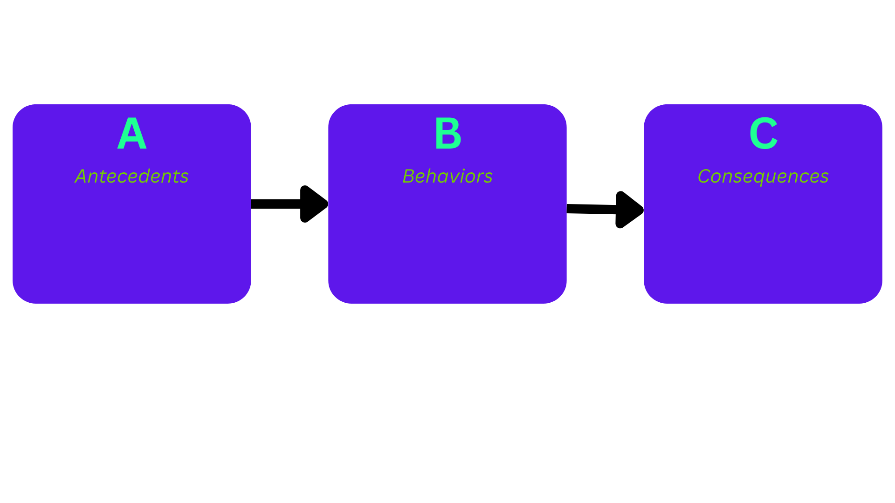

# AI for Applied Behavioral Analysis (ABA)


## Applied Behavioral Analysis (ABA) Fundamentals
Therapy based on the science of learning and behavior.

Positive reinforcement is one of the top strategies used in ABA.

#### Antecedent, Behavior, Consequence (A-B-Cs)

_Antecedent_(**A**): what happens *BEFORE* a behavior occurs

_Behavior_(**B**): person's response or lack of response to the antecedent.

_Consequence_(**C**): what happens *AFTER* a behavior occurs

## Objective
Many people with autism and other neurodivergent traits have difficulty understanding subtle emotional or social cues, which results in anxiety, miscommunication, and stress.
There are many AI chatbots and emotional assistants out there, but only very few incorporate ABA — mostly to diagnose people who might be on the autism spectrum.

The goal is to develop emotionally aware AI tools grounded in *Applied Behavioral Analysis (ABA)* that helps individuals who are neurodivergence to better understand, manage, and respond to social & emotional triggers with clarity and compassion. This would be accomplished by identifying emotional triggers and providing supportive feedback using the ABA model.


## Users
- Individuals with Autism who are self-aware and want to improve
- ABA educators and therapist looking into digital assistive tools
- Parents and caregivers who want to help the child on the spectrum with emotional self-regulation

## Features
### Baseline Model (TF-IDF)
- Utilizes TF-IDF to find the most similar A-B-C examples
    
### RAG Model with LLMs
- Retrieves top-K similar examples using TF-IDF
- Passes them into an LLM to generate a supportive response
### Compliance Safeguards
- Detects unsafe and harmful content
    - uses a list of key phrases to check if content is unethical or unsafe
### Agentic AI

## System Architecture
### TF-IDF Baseline Retriever (non-LLM)
A simple retrieval system used to extract the most similar examples from the ABA dataset.

Pipeline:

1. **Input**
2. **Text Vectorization**
3. **Similarity Matching**
4. **ABA Knowledge Base**
5. **Supportive Response Generation**

Goal:
Provides a standard deterministic baseline model for retrieval with NO involvement of LLMs.

### RAG-based Retriever with LLMs


Pipeline:
1. **Input**
2. **Compliance Filter**
3. **TF-IDF Retrieval**
4. **LLM Prompt Construction**
5. **LLM Response Generation** 

Reasons to use RAG:
- Stay consistent and gentle
- Prevent unsafe or overly clinical advice
- Improve understanding of emotional situations 
- Easy to maintain
- Ability to grow with more examples


### Agentic AI 
A small agent that chooses how to respond before invoking any model.
```
def abaWithAgenticAI(userInput, k=3):
```
is a policy-based agent divided into **FOUR** routes:
- Crisis 
- Unethical 
- Emotional Processing
- Off-Limits

## Security & Compliance
- No user data collection
- Synthetic or anonymized data
- Ethical safeguards to prevent harmful or unethical interpretation

## Methodology
- **Dataset Design**
- **Preprocessing**
- **Baseline Model Design (_TF-IDF_)**
- **RAG Model Design**
- **Evaluation**
- **Ethical Design**


## DISCLAIMER

This tool is an experimental AI project inspired by Applied Behavior Analysis (ABA). It's designed for educational and self-reflective use ONLY. 
It is NOT a substitute for professional therapy, diagnosis, or clinical advice. 


## References & Acknowledgements

- Autism Speaks. “Applied Behavior Analysis (ABA).” Autism Speaks, 2021, www.autismspeaks.org/applied-behavior-analysis.

